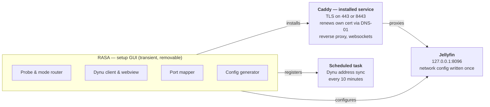
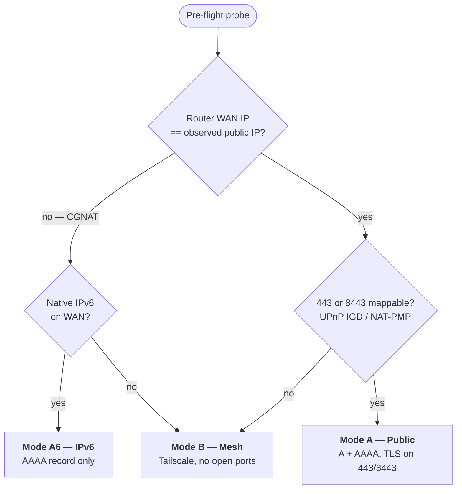
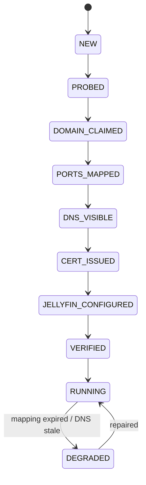

# RASA for Jellyfin

**Remote Access Setup App** — technical specification, revision 3.

One download, one elevation prompt, one screen — then certificates, DNS, router ports, and Jellyfin's own settings are configured, and RASA can be thrown away.

| | |
|---|---|
| **Platforms** | Windows (priority), Linux, Docker |
| **Language** | Go |
| **Proxy** | Caddy, installed as a service |
| **Jellyfin** | 10.11.5 minimum |
| **Distribution** | GitHub Releases + GitHub Pages |
| **Signing** | None (no budget) |

---

## 1. The product promise

The user downloads one installer and never touches a config file, a router admin page, or a Jellyfin settings screen.

| Step | A naive design asks the user to | RASA does automatically |
|---|---|---|
| Install a web server | Obtain and manage Nginx | Caddy bundled, installed as a service |
| Install an ACME client | Obtain and run Certbot | Built into Caddy — renews itself forever |
| Get a domain | Leave for a browser | Claimed in an embedded webview *(1 exception)* |
| Open router ports | *(usually omitted)* | UPnP IGD / NAT-PMP, with guided manual fallback |
| Open the host firewall | *(usually omitted)* | Rule added by the installer |
| Configure Jellyfin | Hand-edit Known Proxies | Written over Jellyfin's REST API |
| Keep it running | Register OS tasks by hand | Service + scheduled task registered at install |

### The three things that genuinely cannot be automated

1. **Accepting a third-party ToS.** Creating a Dynu account requires agreeing to terms and clearing a CAPTCHA. Scripting it is fragile and a terms violation. The embedded webview keeps it inside the app; it does not remove it.
2. **One administrator elevation.** Installing a service, writing a firewall rule, and registering a scheduled task all require elevation. It happens exactly once.
3. **A router that refuses to cooperate.** If UPnP is off and the user is behind CGNAT, no software on the host can open a port. RASA treats this as a routing decision, not a failure — see the mode router.

---

## 2. Verified constraints

Each was checked against primary sources. The two marked **BLOCKER** are why this spec does not use Nginx or Certbot.

| Claim | Finding | Consequence |
|---|---|---|
| **Certbot on Windows** | 🔴 **BLOCKER** — Windows installer discontinued; Feb 2024 was the final Windows release. Official guidance is now "use WSL2." | Cannot depend on it on the primary target OS. |
| **Nginx on Windows** | 🔴 **BLOCKER** — `select()` I/O, single worker, ~1024 connection cap. Documented by nginx as a proof of concept. | Worst-case build for long-lived streaming connections. |
| **caddy-dns/dynu** | ✅ Current — v1.0.0 (May 2026), Caddy 2.10, libdns v1.0.0. Module id `dns.providers.dynu`. | DNS-01 available through the same credential used for IP sync. |
| **Dynu REST API version** | ⚠️ Corrected — current API is **v2**, not v1. Base `https://api.dynu.com/v2`, header `API-Key`. | Any v1 endpoint paths are wrong. |
| **Dynu DDNS domains on the PSL** | ✅ `freeddns.org`, `mywire.org`, `webredirect.org`, `kozow.com`, `loseyourip.com`, `casacam.net`, `ddnsgeek.com`, `gleeze.com`, `opik.net` are listed. | Each user's subdomain gets its own Let's Encrypt rate-limit bucket. |
| **`dynu.com` on the PSL** | 🔴 Excluded, deliberately. | **Hard requirement:** refuse hostnames under `dynu.com` — they share one 50-cert/week bucket with every Dynu user. |

Sources: [Certbot Windows EOL](https://community.letsencrypt.org/t/certbot-discontinuing-windows-beta-support-in-2024/208101) · [certbot#9897](https://github.com/certbot/certbot/issues/9897) · [nginx on Windows](https://nginx.org/en/docs/windows.html) · [caddy-dns/dynu](https://github.com/caddy-dns/dynu) · [libdns/dynu](https://github.com/libdns/dynu) · [Dynu API](https://www.dynu.com/support/api) · [PSL](https://publicsuffix.org/list/)

---

## 3. RASA is an installer, not a resident app

**RASA sets things up and then can be deleted.** That rules out embedding the proxy inside RASA, because uninstalling would take remote access down with it.

Three things must keep working forever, and none of them can be owned by RASA:

| Must run forever | Why | Owner after RASA is gone |
|---|---|---|
| TLS termination and proxying | It *is* the remote access | **Caddy**, installed as an OS service |
| Certificate renewal | Certificates expire at 90 days | **Caddy** — renews itself natively via DNS-01 |
| DDNS address sync | The WAN address changes without warning | **Scheduled task** calling Dynu's update endpoint |

Caddy covers two of three by itself, which is what makes the disposable model practical. The third reduces to a scheduled HTTP request — Dynu's update endpoint uses the requesting address when none is supplied, so it is one authenticated call on a timer. No daemon.

> ⚠️ **The one thing that does not survive cleanly.** UPnP mappings are leases, not settings. RASA requests a permanent lease (IGD duration `0`) and verifies what was granted, but many routers cap it and most drop mappings on reboot. A **manual static forward is the more durable ending** — a stored router setting, not a lease. UPnP stays the default because it costs the user nothing; where the lease is finite, RASA offers to convert.

---

## 4. Architecture



Everything to the right of RASA persists after it is deleted. Caddy renewing its own certificate is what makes that possible — without it, something would have to stay resident to run ACME every sixty days.

### Why DNS-01 rather than the webroot challenge

HTTP-01 requires port 80 reachable from the internet *before a certificate can be issued at all*, coupling "can I get a cert" to "can traffic reach me." Many residential ISPs block inbound 80. DNS-01 through the Dynu API decouples them, and three things evaporate: the bootstrap config, the config swap, and the renewal hook.

It also unlocks the fallback that prevents dead ends: with issuance independent of port 80, the proxy can listen on **8443** when 443 is unavailable. Jellyfin clients accept a port in the URL.

---

## 5. The mode router

Pre-flight is a *router*, not a diagnostic gate. It probes, picks a mode, and proceeds. The user never sees a dead end.

The CGNAT check that works is a comparison: ask the router's IGD for its WAN address and compare to the externally observed public IP. If they differ, the host is behind carrier-grade or double NAT and port forwarding will never succeed.



Both "no" branches converge deliberately: Mode B is the universal fallback that works behind any NAT, so the tree has no failure leaf.

| Mode | Guest needs | Works behind CGNAT | Open ports | Chosen when |
|---|---|---|---|---|
| **A — Public** | Nothing | No | 443 or 8443 | Default; ports mappable |
| **A6 — IPv6** | IPv6-capable connection | Yes | 443 (v6) | CGNAT on v4, native v6 present |
| **B — Mesh** | Tailscale installed | Yes | None | Fallback; nothing else viable |

> **Cloudflare Tunnel is excluded entirely** — not shipped in any mode, including advanced. Cloudflare's terms restrict proxying non-HTML video streaming through the CDN, and Jellyfin-over-Tunnel has drawn enforcement. Mode B covers the same situation without steering users into a terms violation.

---

## 6. Port forwarding

UPnP is the happy path; manual forwarding is the fallback that always works. Generic guides fail because they can't tell the user which values to type or where their router hides the setting. RASA can determine both.

### Identifying the router

| Method | Yields | Available when |
|---|---|---|
| **IGD device description** — fetch the XML SSDP points at, read `manufacturer`, `modelName`, `modelNumber` | Exact make and model | UPnP enabled — covers "UPnP on but mapping refused" |
| **Gateway HTTP banner** — request the gateway admin page, read title and server header | Usually vendor | UPnP off but admin interface answers |
| **Gateway MAC OUI** — gateway MAC from the ARP table, vendor prefix lookup | Vendor only | **Always** — needs no router cooperation |

Ship the OUI table and router instructions as data files in the repo, fetched at runtime with a baked-in fallback. New routers become a pull request, not a release.

```json
// routers.json — community-maintainable
{
  "asus": {
    "match": { "oui": ["00:1F:C6", "2C:56:DC"], "banner": ["ASUS"] },
    "path":  "WAN → Virtual Server / Port Forwarding",
    "note":  "Set 'Enable Port Forwarding' to Yes before the table accepts rows."
  },
  "tp-link": {
    "match": { "banner": ["TP-Link", "Archer"] },
    "path":  "Advanced → NAT Forwarding → Virtual Servers"
  },
  "fritzbox": {
    "match": { "banner": ["FRITZ!Box"] },
    "path":  "Internet → Permit Access → Port Sharing"
  },
  "_default": {
    "path": "Look for 'Port Forwarding', 'Virtual Server', or 'NAT'",
    "note": "Menu names vary by firmware version."
  }
}
```

### What the instructions must contain

The menu path is the smaller half. The values are what users get wrong, and RASA knows all of them — present them filled in:

| Field | Value RASA supplies |
|---|---|
| Router admin page | Detected default gateway, as a clickable link |
| Internal / private IP | This host's LAN address |
| Internal and external port | The chosen listener port — 443, or 8443 on fallback |
| Protocol | TCP |
| Service name | A suggested label, recognisable in a year |

> 🔴 **The DHCP reservation is not optional.** A static forward points at a fixed LAN address. If this host holds an ordinary DHCP lease, that address will change and the forward points at nothing — the most common reason a manual forward works for weeks then silently stops. Detect whether the address is leased or static, and when leased, treat reserving it as **part of the instructions**. It lives in the same router UI, usually one menu away.

### Confirming it worked

Never end on "you should be all set." Finish with a **Test again** button that re-probes from outside and gives a plain yes or no, reusing the Phase 7 external prober.

Offer manual instructions **only when the CGNAT check passed**. Behind CGNAT no forward can work, and walking someone through one is worse than telling them plainly.

### Warnings

- UPnP accepted with a finite lease → a reboot will likely clear it; offer to convert to static.
- UPnP accepted as permanent → some routers drop mappings on reboot regardless.
- UPnP used at all → leaving it enabled lets any device on the network open ports.

Because RASA is deleted, a warning shown once is gone when it matters. **Write a plain-text recovery file** with what was configured, the exact forwarding values, and what to check if it stops working.

---

## 7. Domain strategy

**Decided: the user brings their own Dynu account, created in an embedded webview.** No backend, no operating cost, no domain to buy — the only option consistent with a disposable installer distributed from a GitHub repo. Keep the code behind a `DomainProvider` interface so a managed-subdomain option stays possible later.

### The webview flow

1. RASA opens an embedded browser at Dynu's signup. The user creates *their* account; RASA never sees the credentials.
2. On completion, RASA navigates the same webview directly to the API credentials page.
3. The user copies their API key. RASA shows a paste field beneath the webview and watches the clipboard so it fills itself.
4. RASA validates the key with a live API call before advancing.

> **On OAuth.** Dynu exposes `/v2/oauth2/token`. With the webview approach it largely doesn't matter — even a full OAuth flow requires the account to exist first, so signup and CAPTCHA remain. OAuth removes one copy-paste, not a screen. Polish item.

> ⚠️ **Do not scrape the key out of the page.** Injecting JS to lift the API key breaks the first time Dynu changes markup, is indistinguishable from credential theft to security tooling, and fails silently. A visible paste that always works beats an invisible one that usually does.

---

## 8. Choosing a hostname

**There is no API for this — the list must ship with the app.** Dynu's `GET /dns` returns domains an account *already owns*. Nothing enumerates what's on offer, and no availability-check endpoint is documented. Do not scrape the control panel.

### Only 9 of the 12 free domains are safe

| Parent domain | PSL | Ship it | Parent domain | PSL | Ship it |
|---|---|---|---|---|---|
| `freeddns.org` | ✅ | Yes — default | `casacam.net` | ✅ | Yes |
| `mywire.org` | ✅ | Yes | `ddnsgeek.com` | ✅ | Yes |
| `webredirect.org` | ✅ | Yes | `gleeze.com` | ✅ | Yes |
| `kozow.com` | ✅ | Yes | `opik.net` | ✅ | Yes |
| `loseyourip.com` | ✅ | Yes | `ezgateway.net` | ❌ | **No** |
| `flashhub.net` | ❌ | **No** | `remotewire.net` | ❌ | **No** |

The three exclusions are absent from the PSL, so all their users share a single 50-cert/week Let's Encrypt bucket — producing failures users cannot see the cause of. `dynu.com` and `dynu.org` are also absent and stay blocked regardless of account tier.

### The control: name first, domain pre-chosen

The parent domain is cosmetically irrelevant to the user. Default it to `freeddns.org`, focus the name field, and let the screen be satisfied by typing one word.

```
What should your server be called?

  [ mymedia            ]  .freeddns.org ▾

  → https://mymedia.freeddns.org
```

### Collisions are where the dropdown earns its place

On a shared domain this popular, `media`, `jellyfin`, and `home` are long gone. Rather than mangling the name into `media47`, **offer the same name on a different parent domain**:

```
✗ mymedia.freeddns.org is taken

  Available with the same name:
    mymedia.kozow.com      mymedia.mywire.org
    mymedia.gleeze.com     mymedia.opik.net
```

### Checking availability

- **Instant feedback** — resolve the candidate over DNS as they type, debounced. Advisory only: a claimed hostname with no records won't resolve, so a negative is *not* proof it's free.
- **Authoritative** — the creation call itself. Treat its conflict response as the real answer.

Never show a confident "available!" on DNS evidence alone.

### Keeping the list current

Bake the nine in as a build-time default, then fetch a JSON list at startup with fallback to the baked copy. With no backend, a raw file in the repo is the natural home.

> ⚠️ **Add a CI job that re-runs this audit.** Fetch Dynu's offered domains and the PSL, intersect, and fail the build if the shipped list contains anything unlisted. This comparison is how the three unsafe domains surfaced.

---

## 9. The user's journey

Happy path on Windows, ~7 minutes. Only steps 6–8 need the user at the keyboard.

| # | Step | Time | The user | RASA |
|---|---|---|---|---|
| 1 | Download | 30s | Clicks one button on the Pages site | UA detection redirects to the matching release asset |
| 2 | ⚠️ **SmartScreen** | 20s | Sees "Windows protected your PC" → More info → Run anyway | Nothing — not running yet. Only lever is the download page |
| 3 | Install and elevate | 40s | Clicks through; accepts **one** UAC prompt | Installs its files and bundled Caddy, launches itself elevated |
| 4 | Welcome | 10s | Reads a paragraph, clicks **Set up remote access** | Checks for a state file; if found this becomes a repair screen |
| 5 | Checking things over | 15s | Watches four lines tick green | Finds Jellyfin + real port from `network.xml`, checks version floor, resolves public IP, CGNAT comparison, port ownership, runs mode router |
| 6 | Sign in to Jellyfin | 20s | Enters admin username/password, or uses an API key | Authenticates, confirms the account is actually an admin |
| 7 | ⚠️ **Create a Dynu account** | 2 min | Signs up in the webview, accepts ToS, clears CAPTCHA, copies the key | Hosts the webview, navigates to the credentials page, watches clipboard, validates the key |
| 8 | Pick a name | 30s | Types one word, sees the address form underneath | Debounced availability check; cross-domain suggestions on collision |
| 9 | Open the port | 10s* | Usually nothing; else gets router named + exact values + **Test again** | Permanent UPnP lease request, router identification, instructions from `routers.json` |
| 10 | Setting everything up | 2 min | Watches six lines tick green | Creates hostname + records, polls authoritative NS, installs Caddy service, DNS-01 issuance, writes Jellyfin config, registers sync task |
| 11 | Prove it works | 10s | "Testing from outside your network…" then green | Fetches `/System/Info/Public` over the **public** path, not loopback |
| 12 | Done | — | Gets the address with Copy / QR / Open | Writes state + recovery files, offers to uninstall itself |

**Every fork happens invisibly at step 5.** A CGNAT result quietly routes to Mode A6 or B; a busy port quietly moves the listener to 8443. The user is told the outcome, never asked to decide.

### What the walkthrough exposed

- **Elevation must cover the whole run, not just the install.** Installing a service, writing a firewall rule, and registering a scheduled task all need privileges, and the final port isn't known until step 9. RASA's manifest requests administrator; the installer launches it elevated.
- **Firewall rules scope to the Caddy binary, not a port.** The listener port is decided at step 5 or 9. A program-scoped rule covers 443 and 8443 without knowing which wins, and is tighter than opening ports.
- **Step 10 is where interrupted installs happen.** Longest unattended stretch, least legible. Every transition must be idempotent — the repair path in step 4 is a real screen users will meet.

---

## 10. Setup pipeline

Presented as one progress screen. Implemented as an idempotent, resumable state machine.

**01 · Install** *(elevated)* — installer per platform; install bundled Caddy and register it as a service with auto-start; add the host firewall rule. Only elevation prompt in the product.

**02 · Discover and probe** — find Jellyfin, read its real port from `network.xml` (never hardcode 8096); assert the 10.11.5 floor; resolve public IPv4/IPv6; IGD WAN comparison for CGNAT; local port ownership; run the mode router and record the evidence.

**03 · Claim the hostname** — availability check, PSL allowlist validation, create hostname with A/AAAA, persist the credential to protected storage.

**04 · Open the path** — permanent UPnP/NAT-PMP lease request and read-back; external re-probe; router identification; manual instructions with DHCP reservation on refusal; 8443 retry before falling back to Mode B.

**05 · Wait for DNS, then issue** — **poll authoritative nameservers until the record is visible** before touching ACME. Failed validations are capped at 5/hostname/hour; back off rather than retrying into the limit.

**06 · Configure Jellyfin** — write network configuration over REST; restart if required and wait for it to return.

**07 · Verify and hand over** — fetch `/System/Info/Public` *through the public path*. Show the URL with copy and QR. Write state and recovery files.

### State machine



Every transition must be safe to re-run. Claiming a hostname you already own succeeds. Mapping an already-mapped port succeeds. Issuing a valid existing certificate is a no-op.

---

## 11. Proxy configuration

The entire two-file Nginx setup, the bootstrap-then-production swap, and the reload hook reduce to this, generated at runtime and handed to the Caddy service.

```caddyfile
# generated — never hand-edited by the user
{
  admin off
  # acme_ca https://acme-staging-v02.api.letsencrypt.org/directory
}

{$RASA_HOSTNAME}{$RASA_PORT_SUFFIX} {
  tls {
    dns dynu {env.RASA_DYNU_TOKEN}
    resolvers 1.1.1.1 9.9.9.9
  }

  encode zstd gzip

  rate_limit {
    zone auth {
      match { path /Users/AuthenticateByName }
      key    {remote_host}
      events 10
      window 1m
    }
  }

  log {
    output file /path/to/shared/logs/caddy.log
    format json
  }

  reverse_proxy 127.0.0.1:{$RASA_JELLYFIN_PORT} {
    flush_interval -1        # disable buffering for streaming
    transport http {
      read_timeout    10m    # long-lived websockets
      write_timeout   10m
    }
  }
}
```

`flush_interval -1` is the equivalent of Nginx's `proxy_buffering off` and is required for responsive streaming. The timeout bump prevents idle SyncPlay websockets being dropped at the default.

<details>
<summary><b>If you ever keep Nginx — four real bugs found in the original draft</b></summary>

- **Unconditional `Connection: upgrade` is a genuine bug.** Inside `location /` it is sent on every plain HTTP request, breaking keepalive. Fix:
  ```nginx
  map $http_upgrade $connection_upgrade {
    default upgrade;
    ''      close;
  }
  # then: proxy_set_header Connection $connection_upgrade;
  ```
- **`listen 443 ssl http2;` is deprecated** as of nginx 1.25.1. Use `listen 443 ssl;` plus `http2 on;`.
- **Duplicate `Content-Type`** — `return 200 "text"` already emits `text/plain`; the added `add_header Content-Type` produces a second. Use `default_type`.
- **The config claims the whole nginx instance.** A top-level file with `events{}` and `http{}` clobbers any existing install. Bundle a private instance or write into `conf.d/`.

Also missing: `proxy_read_timeout` bumps (60s default drops idle websockets) and a catch-all `default_server` returning 444. The separate `location /socket` block is redundant.
</details>

---

## 12. Dynu integration

The legacy `/nic/update` endpoint uses HTTP Basic auth and **cannot create a hostname**; the v2 REST API uses an `API-Key` header and can. Standardize on v2 and carry exactly one credential.

| Operation | Endpoint | Notes |
|---|---|---|
| Auth (all calls) | `API-Key: <token>` | Header. Base `https://api.dynu.com/v2` |
| List hostnames | `GET /dns` | Existing hostnames for the account |
| Resolve root domain | `GET /dns/getroot/{hostname}` | Find the zone id |
| Create / update hostname | `POST /dns` | Claims the name |
| Update addresses | `POST /dns/{id}` | IPv4/IPv6 fields — **confirm exact names** |
| List records | `GET /dns/{id}/record` | |
| Add record | `POST /dns/{id}/record` | Used for DNS-01 TXT |
| Delete record | `DELETE /dns/{id}/record/{recordId}` | TXT cleanup |

### Verified schema

✅ **Resolved 2026-08-24 against a live account.** Dynu publishes no reachable OpenAPI document — `/v2/swagger.json`, `/v2/openapi.json` and the other documented locations all return 404 — so the field names below were read from live responses instead. That is stronger evidence than a spec document anyway.

```
GET /v2/dns                    -> {statusCode, domains: [Domain]}
GET /v2/dns/{id}               -> {statusCode, ...Domain}   (flattened, not nested)
GET /v2/dns/{id}/record        -> {statusCode, dnsRecords: [Record]}
GET /v2/dns/getroot/{hostname} -> {statusCode, id, domainName, hostname, node}
```

**Domain:** `id`, `name`, `unicodeName`, `token`, `state`, `group`, `ipv4Address`, `ipv6Address`, `ttl`, `ipv4`, `ipv6`, `ipv4WildcardAlias`, `ipv6WildcardAlias`, `createdOn`, `updatedOn`

**Record:** `id`, `domainId`, `domainName`, `nodeName`, `hostname`, `recordType`, `ttl`, `state`, `content`, `updatedOn` (plus SOA-only fields)

Three findings that change the implementation:

> 🔴 **A DDNS hostname is its own zone apex.** `getroot` for `mymedia.freeddns.org` does **not** return `domainName: "freeddns.org", node: "mymedia"`. It returns `domainName: "mymedia.freeddns.org"` with an **empty** `node`. In Dynu's model the user's hostname *is* their zone; the shared parent belongs to Dynu.
>
> Consequences: DNS-01 TXT records use `nodeName: "_acme-challenge"` relative to that zone, **and the PSL allowlist check in §8 must not use `getroot`'s answer** — it returns the full hostname, so the check would compare the wrong string. Derive the parent from the name instead. This is the same ambiguity that `caddy-dns/dynu` exposes as `own_domain`, which will need setting in the generated Caddyfile (task 6).

> 🔴 **Every `Domain` carries a `token` field** — a per-hostname secret for the legacy update protocol. It arrives unprompted in ordinary list responses, so it must be registered for redaction the moment it is seen or any code path logging a `Domain` leaks it.

> ⚠️ **Errors can arrive inside an HTTP 200**, carried in the body's `statusCode`. Both must be checked. An unknown hostname returns `501 Argument Exception`, not `404`.

### Write endpoints

✅ **Verified 2026-08-24** against a live account: created a disposable hostname, exercised every write path on it, and deleted it. Three behaviours are not what the read endpoints imply:

| Call | Returns | Consequence |
|---|---|---|
| `POST /dns` (create) | `{"statusCode":200}` — **no id, no record** | The id must be resolved with a follow-up `GET /dns`. Everything downstream addresses by id, so a create that does not do this is useless to the caller. |
| `POST /dns` with a name already owned | `505 Validation Exception` | **Create is not idempotent.** SPEC §10 requires every step to be re-runnable, so the client checks for an existing hostname and updates in place instead. |
| `POST /dns/{id}` (update) | `{"statusCode":200}` | Works correctly — both address families persist. Return a re-read rather than the empty body. |
| `DELETE /dns/{id}` | `{"statusCode":200}` | Works. |
| `DELETE /dns/{id}` — unknown id | `501 Argument Exception` | Same response as a **malformed** id. |

> 🔴 **That last row caused a real bug and is worth guarding against permanently.** Because Dynu cannot distinguish "unknown id" from "invalid id", treating `501` as "already gone" means `DeleteDomain(0)` reports success while deleting nothing. The first live run leaked three hostnames onto the account for exactly this reason — the create returned no id, so cleanup ran against id `0` and silently did nothing. Validate ids before every delete.

The `ipv4` and `ipv6` booleans control whether each family is published at all — setting `ipv6Address` without `ipv6: true` does nothing, which is a quiet way to lose Mode A6.

### IPv6 is not optional

Many ISPs issue native IPv6 alongside CGNAT-ed IPv4 — for those users IPv6 is the *only* path that can work, and it is the entire basis of Mode A6. Maintain AAAA alongside A, independently syncable.

### Sync loop

- Poll every 5–10 minutes; update only when the address differs from cache.
- Cache the last-published address so a restart doesn't trigger a spurious update.
- Exponential backoff on API errors; never hot-loop into a rate limit.
- An address change invalidates nothing about the certificate — with DNS-01 the cert is independent of the IP.

---

## 13. Jellyfin auto-configuration

Authenticate via `POST /Users/AuthenticateByName` (or accept an API key), then read and write the named network configuration section.

| Setting | Value | Why |
|---|---|---|
| `KnownProxies` | `127.0.0.1`, plus `::1` | Without it Jellyfin ignores `X-Forwarded-*` and logs every user with the proxy's IP. **Include `::1`** — if the proxy dials over IPv6 loopback and only `127.0.0.1` is listed, this silently fails |
| `EnableRemoteAccess` | `true` | Off by default in some installs |
| `PublishedServerUriBySubnet` | `all=https://<hostname>` | Otherwise Jellyfin hands clients internal URLs and off-network playback breaks in ways that look like a proxy bug |
| `EnableUPnP` | `false` | Stops Jellyfin's own port mapping fighting RASA's |
| Jellyfin-side HTTPS | leave disabled | TLS terminates at the proxy; both causes a redirect loop |
| `BaseUrl` | read, do not change | If set, the generated proxy config must match |

> Jellyfin serves its own OpenAPI document from the local instance. Fetch it during Phase 2 and validate keys against the *actual* running version.

**Deployment detection matters here.** A containerised Jellyfin sees the proxy arriving from the bridge gateway, not `127.0.0.1` — configuring loopback there produces a server that silently logs every user with the wrong address.

---

## 14. State, secrets, and security

### Credential storage

The credential **cannot live in RASA's keystore**, because Caddy needs it to renew certificates and the scheduled task needs it to sync addresses, both long after RASA is gone. It belongs to the services that outlive RASA:

- **Windows** — file under `ProgramData` encrypted with DPAPI at machine scope, ACL'd to the service account and administrators.
- **Linux** — root-owned `0600` env file referenced by the systemd unit's `EnvironmentFile`, or systemd credentials.
- **Docker** — mounted secret or environment variable, with the compose file generated to match.

### Exposure

RASA is what puts a login form on the public internet, so it owns the consequences. The `rate_limit` block throttles credential stuffing against the auth endpoint. Check admin password strength during the wizard and refuse to expose a server with a weak or empty admin password. Offer an advanced toggle to restrict `/Dashboard` to the local network.

---

## 15. Logging, errors, and warnings

Three constraints: RASA **deletes itself**, there is **no backend**, and the things it installs run for **years afterwards**. Most real failures happen long after the app is gone.

### Two audiences, never the same string

| Audience | Needs | Never contains |
|---|---|---|
| **The user**, in the wizard | What happened in their terms, why if knowable, a next action they can take | Error codes, stack traces, API names, jargon, blame |
| **The maintainer**, via a GitHub issue | Structured, timestamped, correlated, with request/response detail and timings | Secrets — API key, Jellyfin password, session token |

### The error contract

Every user-facing error answers **what happened**, **why**, **what now**. Where an action is possible it is a button.

| Situation | Must never reach the user | What the user sees |
|---|---|---|
| ACME rate limit | `429 rateLimited: too many certificates already issued` | "Let's Encrypt is briefly limiting new certificates for this address, usually because setup was retried a few times. Nothing is broken — wait about an hour." **[Try again later]** |
| DNS not yet visible | `context deadline exceeded` | "Your new address isn't visible on the internet yet. This usually takes one to two minutes." **[Keep waiting] [Pick a different name]** |
| Port already mapped | `AddPortMapping failed: 718 ConflictInMappingEntry` | "Your router is already sending port 443 to a different device." **[Use 8443 instead] [Show me how to change this]** |
| Jellyfin login rejected | `401 Unauthorized` | "That username or password didn't work. This is your Jellyfin login — the same one you use at localhost:8096, not your Dynu account." |
| Carrier-grade NAT | `WAN addr 100.87.4.12 != observed 203.0.113.5` | "Your internet provider doesn't give this connection a direct address, common on mobile and some fibre plans. Opening a port can't work here, so RASA will set up a private connection instead." |
| Jellyfin below floor | `version constraint 10.11.5 unsatisfied` | "Your Jellyfin is version 10.10.3, and RASA needs 10.11.5 or newer. Update Jellyfin, then run RASA again." |
| Port 443 held locally | `bind: address already in use` | "Something else on this computer is already using port 443 — it looks like IIS. RASA will use 8443 instead, so your address will end in `:8443`." |

> **An error must say whether anything was left half-configured.** A failure at step 10 may have already created a DNS hostname and installed a service. Say so, and offer to resume or clean up.

### Warnings have a lifecycle problem

"Later" is exactly when RASA no longer exists. **Every warning must be written to the recovery file as well as shown:** finite UPnP lease, unreserved DHCP address, UPnP left enabled, weak admin password on a now-public server, listener on 8443.

### What to log

- **Structured lines** — JSON, one object per event, with timestamp, level, phase, run id.
- **A run identifier per attempt.** Users retry; without it a bundle with four runs is unreadable.
- **Every external call** to Dynu, Let's Encrypt, the router, Jellyfin: method, target, status, duration, retries.
- **Decisions, not just outcomes.** *"chose Mode A: router WAN matches observed address, UPnP granted permanent lease on 443"* answers most support questions alone.
- **Every state transition,** so an interrupted run shows where it stopped.

> 🔴 **Redaction is a tested feature, not a convention.** Assume every diagnostic bundle gets pasted into a public GitHub issue — it will. The Dynu key, Jellyfin password, and session token must never reach a log line, with unit tests asserting it. Treat hostname and public IP as *semi-sensitive*: redacted by default with an "include my address" toggle.

### Logs must outlive RASA

| Source | Records | Lives until |
|---|---|---|
| **RASA** — setup log | The whole wizard run, per run id | Forever — **explicitly preserved on uninstall** |
| **Caddy** — service log | Renewal attempts, TLS errors, proxy failures | Rotating, indefinitely |
| **Sync task** — address updates | Each run's result and address seen | Rotating, indefinitely |

Caddy defaults to the service log, awkward to find on Windows — the generated Caddyfile directs a structured log to the shared directory instead.

> ⚠️ **The sync task needs a heartbeat.** A scheduled task quietly failing for six months is the most plausible silent failure in this design. Write `last-sync.txt` with timestamp, address seen, and result on **every** run including successes. That makes "is this still working?" answerable by opening one file.

### Anti-patterns

- An error code with no explanation, or "an unknown error occurred."
- Wording implying the user did something wrong — nearly every failure here is the network's fault.
- A spinner with no text, especially during the two-minute DNS wait.
- A dead end whose only recovery is reinstalling.
- Logging a secret "temporarily" while debugging.
- Deleting logs on uninstall — the moment they become most valuable.

---

## 16. Advanced mode

Every automatic decision needs a visible override, with the auto-detected value pre-filled:

- **Bring your own domain** — any hostname the user controls, with a choice of libdns provider.
- **Bring your own Dynu account** — paste an existing API key.
- **Force a mode** — override the router's choice.
- **Custom ports** — external listener and Jellyfin's port.
- **Manual port forwarding** — skip UPnP, with generated per-router instructions and a re-test button.
- **Remote Jellyfin** — a different machine on the LAN.
- **Existing reverse proxy** — detect a running nginx/Caddy/Traefik and emit a config fragment instead of taking over the ports.
- **Tailscale (Mode B)** — installed on demand here.
- **Staging certificates** — issue against Let's Encrypt staging.

---

## 17. Packaging and distribution

GitHub Releases, no website, no code-signing budget.

> 🔴 **A single file cannot dispatch across operating systems.** Windows executes PE, Linux ELF, macOS Mach-O — mutually incompatible, and the kernel decides from the header before any of our code runs. Detection logic must *already be executing* to detect anything.
>
> Polyglot files (a valid PE that is also a valid shell script) do exist and work, but they cannot be signed and are a recognised malware packing technique that endpoint protection flags on sight. For an unsigned app whose job is to open firewall ports, that is fatal.

### What delivers the same experience

- **A GitHub Pages front door** whose download button reads the user agent and redirects to the correct release asset. Free, no server, and somewhere to put the SmartScreen instructions.
- **Unambiguous asset names** — platform and architecture spelled out.
- **Each installer self-contained,** including the bundled Caddy binary.
- **Publish SHA-256 checksums.** With no signature this is the only integrity signal available.

### Considered and rejected: a polyglot bootstrapper

```sh
:; echo "running on unix"; exec ./rasa-linux "$@"; exit 0
@echo off
start rasa-windows.exe %*
```

On a POSIX shell `:` is the null command and the line executes; on `cmd.exe` a line beginning with `:` is a label and is skipped. This genuinely works. It is still wrong here:

1. **It makes the trust problem much worse.** An unsigned script that selects and executes a binary is textbook malware behaviour and is treated far more harshly than a plain unsigned installer. This alone disqualifies it.
2. **The UX diverges anyway** — Windows users double-click a `.cmd`; Linux users need `chmod +x` and a terminal.
3. **It does not bundle** — either everything ships in one archive to extract, or it downloads at runtime, giving up self-containment.

> **Where the script approach *is* worth adopting:** Linux. A `curl | sh` installer that detects distro and arch is idiomatic there and carries none of the antivirus baggage. Ship it for Linux; keep Windows on a plain installer.

### Building Caddy with the Dynu module

Stock Caddy ships **neither** module the generated config needs. The release pipeline must produce a custom binary per platform:

```sh
xcaddy build \
  --with github.com/caddy-dns/dynu \
  --with github.com/mholt/caddy-ratelimit
```

`caddy-dns/dynu` provides the DNS-01 challenge; `caddy-ratelimit` provides the `rate_limit` directive that throttles the login endpoint. A stock binary fails at start with an unrecognised-directive error — **after RASA has already reported success** — so this is worth a build-time check rather than trusting the packaging step.

**Pin both versions.** An unpinned build means the proxy changes underneath users between releases.

### Unsigned distribution is the largest adoption risk

An unsigned installer that requests elevation and opens firewall ports is the exact profile SmartScreen exists to stop. SmartScreen reputation attaches to the *file hash* with no certificate, so it never accumulates — every release starts from zero.

Mitigate rather than ignore: document the bypass with screenshots on the Pages site and README; say plainly why it appears; display checksums prominently; consider winget submission later.

> ⚠️ **macOS is out of scope for v1.** Distributing outside the App Store requires notarization, which requires paid Apple Developer membership. Without it Gatekeeper *blocks* the app — not a bypassable warning. Keep OS-specific code behind interfaces.

### Docker is a runtime mode, not a third OS build

| Capability | Inside a container | Handling |
|---|---|---|
| Jellyfin discovery on loopback | `127.0.0.1` is the *container's* loopback | Require `--network host`, or take the address as explicit config |
| UPnP / NAT-PMP | SSDP multicast doesn't cross a bridge network | Needs host networking; else manual port config |
| Service registration | No init system | Restart policy; Caddy as its own compose service |
| Scheduled DDNS task | No cron or Task Scheduler | Sidecar container or compose service |
| Host firewall rule | Not the container's concern | Document as an operator step |
| Secret storage | DPAPI and libsecret unavailable | Env var or mounted file with enforced permissions |
| Wizard UI | No desktop session | Serve over a local HTTP port |

The natural Docker deliverable is a **generated compose file** — RASA in container mode gathers the same answers and emits a stack containing Caddy and the sync sidecar.

---

## 18. Implementation tasks

| # | Task | Notes |
|---|---|---|
| 1 | Project skeleton, state store, logging | Go module; typed state machine; secret storage per OS. **Structured logging with run ids and tested redaction belongs here** — everything logs through it, and retrofitting redaction is how secrets leak |
| 1b | Error catalogue | Typed errors carrying user message, technical detail, recovery action. Prevents raw errors reaching the UI by construction |
| 2 | Dynu v2 client | Pull the OpenAPI doc with a real key and generate it. Cover A, AAAA, TXT |
| 3 | Probe suite | Jellyfin discovery via `network.xml`, public IP resolution, IGD WAN query, CGNAT comparison, local port ownership |
| 4 | Mode router | Pure function over probe results — trivially unit-testable, and where bugs will hide |
| 5 | Port mapper and router guide | UPnP IGD + NAT-PMP with permanent-lease request; router identification by IGD description, banner, MAC OUI; instruction renderer from `routers.json`; external re-verification |
| 6 | Caddy service installer | Build with `xcaddy` + Dynu module in CI, bundle, install as a service, generate the Caddyfile from state |
| 7 | DNS propagation waiter | Poll authoritative NS until visible. Gates ACME |
| 8 | Jellyfin config client | Authenticate, read live OpenAPI doc, write network settings, verify |
| 9 | Wizard UI | Progress screen with live status lines; advanced overrides; QR handoff |
| 10 | Service and installer | Per-OS service registration, firewall rule, packaging |
| 11 | Scheduled task installer | Register the Dynu sync as a Scheduled Task or systemd timer that survives RASA's removal |
| 12 | State file and re-run mode | Detect a prior install, offer repair, component removal, Caddy replacement |
| 13 | Diagnostic bundle and recovery file | Redacted zip covering all three log sources; plain-text recovery file with warnings, forwarding values, log locations. Producible from repair mode after uninstall |

### Why Go

Single static binaries per platform keep the installer simple; the UPnP, DNS, and service-management libraries are mature; sharing a language with Caddy means the config generator can be validated against real Caddy config types rather than string templating. The UI needs a genuine webview regardless (decision 1 puts Dynu's signup inside the app), so a Go webview wrapper such as Wails covers both the wizard and the signup with one dependency.

---

## 19. Testing

> 🔴 **Use the staging endpoint from the first commit.** Let's Encrypt allows 5 failed validations per hostname per hour and 50 certificates per registered domain per week. You will exhaust both on day one of debugging against production, then wait, unable to test. Default to staging in all development builds; require an explicit flag for production.

- **ACME** — run [Pebble](https://github.com/letsencrypt/pebble) in CI for issuance tests with no external dependency.
- **Dynu** — record real API responses once, then replay. The live API is rate-limited and slow.
- **Mode router** — pure unit tests over synthetic probe results. Cover CGNAT, double NAT, IPv6-only, no-UPnP.
- **Redaction** — unit tests asserting secrets never reach a log line.
- **Jellyfin** — test against containers at the 10.11.5 floor and current.
- **The hard one** — external reachability cannot be tested from inside the network. You need a small external prober, and it is worth building early since Phase 7 depends on it in production too.

---

## 20. Decisions

| # | Question | Decision |
|---|---|---|
| 1 | Domain strategy | User's own Dynu account via embedded webview. No backend |
| 2 | Product name and distribution | **RASA for Jellyfin**. GitHub Releases, no website |
| 3 | Jellyfin authentication | Offer both: admin username/password, or an existing API key |
| 4 | Where Jellyfin runs | Same host by default; LAN-remote in advanced setup |
| 5 | GUI or CLI | GUI. The audience would not use a CLI |
| 6 | Platform priority | Windows first for testing |
| 7 | macOS | ❌ Out — blocked by 13; notarization requires paid Apple membership |
| 8 | Docker scope | Both: run inside a container, and detect a containerised Jellyfin |
| 9 | Tailscale | Installed only via advanced setup |
| 10 | Cloudflare Tunnel | ❌ Excluded — streaming through it violates their terms |
| 11 | Port conflicts | Prefer automatic fallback to another port; take over only with a cancellable warning |
| 12 | Jellyfin versions | 10.11.5 minimum, newest supported |
| 13 | Code signing | ❌ None. Drives 7, makes SmartScreen the main adoption risk |
| 14 | Dynu OAuth | Moot — the webview shows Dynu's own pages |
| 15 | Uninstall | RASA is disposable. A state file at a known path enables detection and repair |
| 16 | Auto-update | Not needed for RASA. **Caddy is the component that needs updating** |
| 17 | Diagnostics | Yes — redacted, user-exportable bundle |
| 18 | Other media servers | Jellyfin only |
| 19 | Multiple servers | Not supported for now |
| 20 | Existing domain | Offered during setup: free hostname, or bring your own |
| 21 | Dynu quota | Not a constraint — free DDNS hostnames do not run out in practice |

### Consequences worth tracking

- **16 shifts rather than disappears.** RASA needs no updater, but the Caddy binary it installs is a public-facing TLS listener that will eventually need patching. Decide deliberately: document a manual update path, or have a RASA re-run detect and offer to replace it. The state file from 15 already provides the hook.
- **17 has no backend to report to.** The user-exportable bundle needs no infrastructure and should be built. Automatic crash reporting would need a service that decisions 1 and 2 rule out.
- **11 resolves better than expected.** Because DNS-01 removes any need for port 80, a conflict on 443 is not a real obstacle — fall back to 8443 silently. Reserve the interrupting warning for an existing reverse proxy.
- **12 removes work.** A 10.11.5 floor means one configuration schema rather than compatibility shims.

### Still to verify

- ~~**Dynu address-field names**~~ — ✅ resolved 2026-08-24; see §12. No OpenAPI document exists, so the schema was captured from live responses.
- ~~**Dynu write endpoints**~~ — ✅ verified 2026-08-24 on a disposable hostname; see §12. Create, update, TXT add/delete, and hostname delete all confirmed, along with idempotency of re-claim and re-delete.
- **Jellyfin configuration keys at 10.11.5** — confirm against the running server's own OpenAPI document.
- **Permanent UPnP lease support** — how many common routers honour lease duration `0`.
- **Clipboard-watch behaviour in the webview** per platform.
